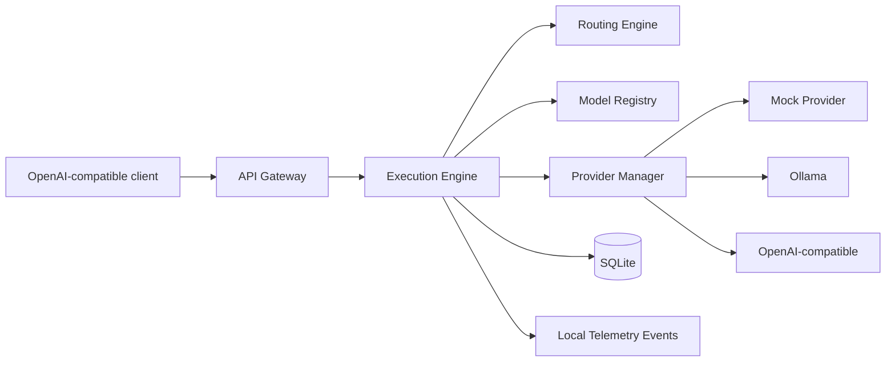

# PolyMind

[](https://github.com/XsYc0/polymind/actions/workflows/ci.yml)

One adaptive AI endpoint powered by every model you own.

PolyMind is a self-hostable OpenAI-compatible gateway that routes `polymind/auto` requests across configured cloud, local, and self-hosted model endpoints. Task 1 implements the engineering foundation and a verified single-model-plus-fallback execution slice.

## What It Is Not

PolyMind is not a hosted AI service, not a credential broker, and not a browser automation tool. It only talks to explicitly configured APIs and local or self-hosted endpoints.

## Current Capabilities

- Fastify API gateway with OpenAI-compatible `/v1/chat/completions`
- Provider SDK with mock, Ollama, and generic OpenAI-compatible adapters
- Model registry, policy filters, health-aware routing, fallback execution
- SQLite trace persistence with prompt hashes by default
- CLI for init, serve, doctor, provider/model listing, and config validation
- Unit, integration, and e2e tests that require no paid API

## Architecture



## Quick Start

```bash
corepack enable
pnpm install
pnpm --filter @polymind/cli polymind init --config polymind.yaml
pnpm --filter @polymind/cli polymind serve --config polymind.yaml
```

## Curl Example

```bash
curl -X POST http://localhost:8080/v1/chat/completions \
  -H "Content-Type: application/json" \
  -d '{"model":"polymind/auto","messages":[{"role":"user","content":"Explain what PolyMind does."}]}'
```

The response is an OpenAI-style chat completion with an extra `polymind` metadata object containing trace ID, selected provider/model, routing strategy, reason, latency, and attempt count.

## OpenAI SDK Example

See [examples/openai-sdk/index.mjs](examples/openai-sdk/index.mjs). Use any local dummy API key because the request goes to PolyMind.

## Ollama Example

Enable the `ollama-local` provider in `polymind.example.yaml`, make sure Ollama is running at `http://127.0.0.1:11434`, and add or update a local model entry with the installed Ollama model name.

## Routing Strategies

- `direct`: preserve eligible registry order
- `lowest-cost`: prefer configured low-cost models
- `lowest-latency`: prefer higher relative speed
- `balanced`: weighted quality, cost, speed, health, local preference, and recent failures
- `local-first`: prefer local models, then balanced score
- `fallback-chain`: preserve eligible order for controlled fallback

## Privacy

Trace content retention defaults to disabled. PolyMind stores prompt hashes and safe execution metadata unless `storage.storeRequestContent` is explicitly enabled.

## Repository Structure

- `apps/gateway`: Fastify API server
- `apps/cli`: local CLI
- `packages/contracts`: domain contracts and schemas
- `packages/config`: YAML loading, validation, redaction
- `packages/provider-sdk`: provider interfaces and normalized errors
- `packages/model-registry`: provider/model registry and filters
- `packages/router`: deterministic routing engine
- `packages/execution-engine`: request execution and fallback
- `packages/persistence`: in-memory and SQLite repositories
- `integrations/*`: provider and upstream integration boundaries

## Development Commands

```bash
pnpm format
pnpm lint
pnpm typecheck
pnpm test
pnpm build
pnpm ci
pnpm doctor
```

## Docker

```bash
docker build .
docker compose up
```

The default Compose stack uses the mock provider and a persistent local volume. Ollama is optional and is not downloaded by Compose.

## Roadmap

Future build tasks can add richer policy history, multi-agent execution, dashboard UI, optional OmniRoute/Ruflo adapters, OpenTelemetry export, and advanced streaming.

## Integration Status

OmniRoute and Ruflo are documented as optional future integration boundaries. Task 1 does not copy code or make fabricated API calls.

## License

MIT. See [LICENSE](LICENSE).

## Limitations

Streaming is represented by provider abstractions but the gateway rejects streaming requests in Task 1. Runtime provider mutation is intentionally deferred to config-driven administration.
